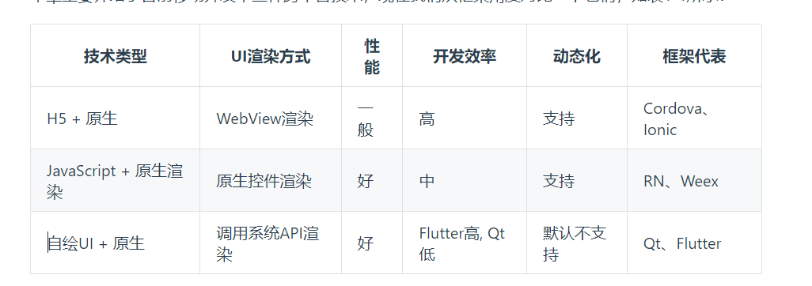
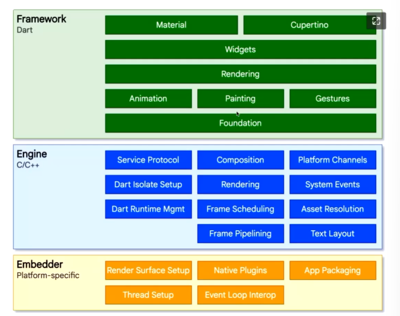

## 前言

### 关于Hybrid

1. H5 + 原生(JSBridge + webView)
>   这类框架主要原理就是将 App 中需要动态变动的内容通过HTML5（简称 H5）来实现，通过原生的网页加载控件WebView （Android）或 WKWebView（iOS）来加载（以后若无特殊说明，我们用WebView来统一指代 Android 和 iOS 中的网页加载控件）。这种方案中，H5 部分是可以随时改变而不用发版，动态化需求能满足；同时，由于 H5 代码只需要一次开发，就能同时在 Android 和 iOS 两个平台运行，这也可以减小开发成本，也就是说，H5 部分功能越多，开发成本就越小。我们称这种 H5 + 原生 的开发模式为混合开发 ，采用混合模式开发的App我们称之为混合应用或 HTMLybrid App ，如果一个应用的大多数功能都是 H5 实现的话，我们称其为 Web App 。


Web App问题：性能瓶颈导致用户体验不佳，复杂功能难以实现

------

2. JS + 原生UI（React Native【facebook基于react容器】\weex【阿里基于vux容器】）
> 核心技术点：把Dom映射在原生的控制树，框架会把dom树自动转化为不同平台的控件树，其最终还是调用原生的API来绘制。

- 混合开发的优点
    - 社区庞大，开发成本低
    - 使用前端技术框架，原生渲染，性能尚可
    - 支持热更新
- 混合开发的缺点
    - 与原生通信，难以胜复杂的绘制和动画工作
    - js为脚本语言，解释执行，性能和原生开发编译后运行，有一定差距
    - 调用系统用硬件功能非常麻烦

3. 自绘引擎
> 不依赖操作系统提供的布局、原生组件能力，直接调用GPU或底层抽象层进行控制的渲染引擎
- QtMobile
    基于c++,最佳表现不佳
- Flutter
    通过Dart语言构建一套跨平台的开发组件。是Google推出并开源的移动应用开发框架，主打跨平台，高保真，高性能。一套代码运行在ios和安卓。


## 初始flutter

> Flutter 是 Google 推出并开源的移动应用开发框架，主打跨平台、高保真、高性能。开发者可以通过 Dart 语言开发 App，一套代码同时运行在 iOS 和 Android平台。 Flutter 提供了丰富的组件、接口，开发者可以很快地为 Flutter 添加 Native（即原生开发，指基于平台原生语言来开发应用，flutter可以和平台原生语言混合开发） 扩展。

**特点：**

1. 跨平台自绘引擎skia
2. 高性能: AOT(提前编译)；JIT(即时编译)
3. Dart开发
    - 开发效率高
    - 高性能
    - 快速内存分配
    - 类型安全和空安全

**框架结构：**

- 框架层Framework
    1. 底下两层
    2. Rendering 层，即渲染层，
    3. Widgets 层是 Flutter 提供的的一套基础组件库，在基础组件库之上，Flutter 还提供了 Material 和 Cupertino 两种视觉风格的组件库，它们分别实现了 Material 和 iOS 设计规范。
- 引擎层Engine
Engine，即引擎层。毫无疑问是 Flutter 的核心， 该层主要是 C++ 实现，其中包括了 Skia 引擎、Dart 运行时（Dart runtime）、文字排版引擎等。在代码调用 dart:ui库时，调用最终会走到引擎层，然后实现真正的绘制和显示。

- 嵌入层
Embedder，即嵌入层。Flutter 最终渲染、交互是要依赖其所在平台的操作系统 API，嵌入层主要是将 Flutter 引擎 ”安装“ 到特定平台上。嵌入层采用了当前平台的语言编写，例如 Android 使用的是 Java 和 C++， iOS 和 macOS 使用的是 Objective-C 和 Objective-C++，Windows 和 Linux 使用的是 C++。 Flutter 代码可以通过嵌入层，以模块方式集成到现有的应用中，也可以作为应用的主体。Flutter 本身包含了各个常见平台的嵌入层，假如以后 Flutter 要支持新的平台，则需要针对该新的平台编写一个嵌入层。


#### 安装


## Dart 语言

强类型语言
1. 变量声明
    1. var关键字
        一旦定义就确定类型
    2. dynamic 和 Object
        Object时Dart的所有对象的根基类。所以任何类型的数据都可以赋值给Object声明的对象
        dynamic 和 Object都可以赋值任意对象，且可改变
        1. dynamic声明的对象编译器会提供所有可能的组合,当变量没有某个属性时，编译时不会报错，但是运行时是会报错的
        2. Object声明的对象只能使用 Object 的属性与方法, 否则编译器会报错
    3. final 和const
        如果您从未打算更改一个变量，那么使用 final 或 const，不是var，也不是一个类型。 一个 final 变量只能被设置一次，两者区别在于：
        1. const 变量是一个编译时常量（编译时直接替换为常量值）
        2. final变量在第一次使用时被初始化。
        被final或者const修饰的变量，变量类型可以省略，
        ```dart
            //可以省略String这个类型声明
            final str = "hi world";
            //final String str = "hi world"; 
            const str1 = "hi world";
            //const String str1 = "hi world";
        ```
    4. 空安全（null-safety）
        Dart 中一切都是对象，这意味着如果我们定义一个数字，在初始化它之前如果我们使用了它，假如没有某种检查机制，则不会报错，现在我们引入了空安全，执行不会报错，但是会触发一个运行时的错误
        ```dart
            int i = 8; //默认为不可空，必须在定义时初始化。
            int? j; // 定义为可空类型，对于可空变量，我们在使用前必须判空。

            // 如果我们预期变量不能为空，但在定义时不能确定其初始值，则可以加上late关键字，
            // 表示会稍后初始化，但是在正式使用它之前必须得保证初始化过了，否则会报错
            late int k;
            k=9;
        ```
        如果一个变量我们定义为可空类型，在某些情况下即使我们给它赋值过了，但是预处理器仍然有可能识别不出，这时我们就要显式（通过在变量后面加一个”!“符号）告诉预处理器它已经不是null了
  
        ```dart
            class Test{
                int? i;
                Function? fun;
                say(){
                    if(i!=null) {
                    print(i! * 8); //因为已经判过空，所以能走到这 i 必不为null，如果没有显式申明，则 IDE 会报错
                    }
                    if(fun!=null){
                    fun!(); // 同上
                    }
                }
            }
        ```
        - 4.1 函数
            Dart是一种真正的面向对象的语言，所以即使是函数也是对象，并且有一个类型Function。这意味着函数可以赋值给变量或作为参数传递给其他函数，这是函数式编程的典型特征。[函数返回值没有类型推断]
            - 函数声明
            ```dart
                bool isNoble(int atomicNumber) {
                    return _nobleGases[atomicNumber] != null;
                }
            ```
            - 函数作为变量
            ```dart
                var say = (str){
                    print(str);
                };
                say("hi world");
            ```
            - 函数作为参数传递
            ```dart
            //定义函数execute，它的参数类型为函数
            void execute(var callback) {
                callback(); //执行传入的函数
            }
            //调用execute，将箭头函数作为参数传递
            execute(() => print("xxx"))
            ```
                - 可选的参数位置
                ```dart
                String say(String from, String msg, [String? device]) {
                    var result = '$from says $msg';
                    if (device != null) {
                        result = '$result with a $device';
                    }
                    return result;
                }
                say('Bob', 'Howdy'); //结果是： Bob says Howdy
                say('Bob', 'Howdy', 'smoke signal'); //结果是：Bob says Howdy with a smoke signal
                ```
                - 可选的命名参数
                
                ```dart
                //设置[bold]和[hidden]标志
                void enableFlags({bool bold, bool hidden}) {
                    // ... 
                }
                enableFlags(bold: true, hidden: false);
                ```
            **注意，不能同时使用可选的位置参数和可选的命名参数**

            - mixin
                Dart 是不支持多继承的，但是它支持 mixin，简单来讲 mixin 可以 “组合” 多个类，我们通过一个例子来理解。

                ```dart
                class Person {
                    say() {
                        print('say');
                    }
                    }

                    mixin Eat {
                    eat() {
                        print('eat');
                    }
                    }

                    mixin Walk {
                    walk() {
                        print('walk');
                    }
                    }

                    mixin Code {
                    code() {
                        print('key');
                    }
                    }

                    class Dog with Eat, Walk{}
                    class Man extends Person with Eat, Walk, Code{}
                ```
            
            - 异步支持
                Dart类库有非常多的返回Future或者Stream对象的函数。 这些函数被称为异步函数：它们只会在设置好一些耗时操作之后返回，比如像 IO操作。而不是等到这个操作完成。
                - 1. Future
                    和js中的promise相似，表示一个异步操作的最终完成或失败及其结果值的表示。就是用来处理异步操作的。一个Future只会对应一个结果，要么成功，要么失败
                    Future的所有apI的返回值仍旧是一个Future对象，所以很方便进行链式调用
                    - 1.1 Future.then(=== promise.then)
                    - 1.2 Future.catchError(=== promise.catch)
                    - 1.3 Future.whenComplete (===promise.finally)
                    - 1.4 Future.wait (===promise.all)
                        它接受一个Future数组参数，只有数组中所有Future都执行成功后，才会触发then的成功回调，只要有一个Future执行失败，就会触发错误回调。
                - 2. async/await(=== js的async/await)
                    解决回调地狱
                    ```dart
                    task() async {
                        try{
                            String id = await login("alice","******");
                            String userInfo = await getUserInfo(id);
                            await saveUserInfo(userInfo);
                            //执行接下来的操作   
                        } catch(e){
                            //错误处理   
                            print(e);   
                        }  
                    }
                    
            - Stream
            Stream 也是用于接收异步事件数据，和 Future 不同的是，它可以接收多个异步操作的结果（成功或失败）。 也就是说，在执行异步任务时，可以通过多次触发成功或失败事件来传递结果数据或错误异常。 Stream 常用于会多次读取数据的异步任务场景，如网络内容下载、文件读写等
