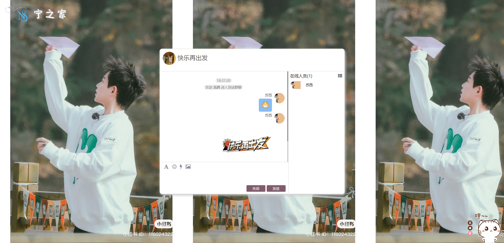

# 实现



# 服务端
    npm i express socket.io socket.io-client
## socket.io
**定义**：Socket.io是一个WebSocket库，包括客户端的js和服务端的nodejs

**目标**: 构建可以在不同浏览器和移动设备上使用的实际应用。它会自动根据浏览器从`WebSocket、AJAX长轮询、Iframe流`等各种方式中选择最佳的方式实现网络实施应用，非常方便与人性化

**特点**
1. 实时分析：将数据推送到客户端，这些客户端会被表示为实时计数器，图表或日志客户。
2. 实时通信和聊天：只需几行代码便可写成一个Socket.IO的”Hello,World”聊天应用。
3. 二进制流传输：从1.0版本开始，Socket.IO支持任何形式的二进制文件传输，例如：图片，视频，音频等。
4. 文档合并：允许多个用户同时编辑一个文档，并且能够看到每个用户做出的修改。

## io.onconnetion：客户端与服务端成功建立连接，接收一个回调函数：socket参数
```js
io.on('connection', (socket) => {
    console.log('客户端与服务端成功建立连接')
})
```
### io.emit:用于向服务器发送消息，有两个参数
```js
io.on('connection', (socket) => {
    // 第一个参数：表示自定义的数据名
    // 第二个参数：需要配合事件传入的参数
    io.emit('loading all clients', usersInfo)//加载所有客户端进来的用户
})
```
### 回调函数中的`socket`
#### socket.on方法：用于接收客户端发送来的消息
```js
io.on('connection', (socket) => {
    // 第一个参数：为客户端自定义的事件名
    // 第二个参数：回调函数callback,(data)=>{},data为客户端传来的参数
    socket.on('connection', data => {
        console.log('client data', data)
    })
})
```
#### socket.emit方法：表示对自己客户端发送消息。
```js
io.on('connection', (socket) => {
    socket.emit('shake', {
        name: '您'
    });
})
```

#### socket.broadcast.emit(): 表示向除了自己以外的客户端发送消息。
    （比如：输入msg点击发送，只需要把msg通过服务器发送给其他客户端用于显示，而本地只需要将msg通过js代码添加到窗口，不用经过服务器了）
```js
io.on('connection', (socket) => {
    // 发出震动，并告诉震动的人
    socket.broadcast.emit('shake', {name: socket.name})
})
```

#### socket.ondisconnect: 表示客户端和服务端断开连接
```js
io.on('connection', (socket) => {
    // 第一个参数：为客户端自定义的事件名
    socket.on('disconnect', () => {
        console.log('user disconnect')
    })
})
```

# 客户端
需要在index.html中引入`<script src="/socket.io/socket.io.js"></script>` 方可使用io(用的是socket.io-client)

## 使用
```js
    // io-client
    // 连接成功会触发服务器端的connection事件
    const socket = io(); 
```
## socket.emit(EventName, param1, param2, …..)
定义： 用于客户端向服务端发送消息，服务端与之对应的是`socket.on`方法来接收消息
```js
 const socket = io();
 socket.emit('client msg', {
     msg: 'hello world'
 })
```
## socket.on('', cb)
定义：用于接收服务端发来的消息
```js
 const socket = io();
 socket.on('server msg', data => {
     console.log(data.msg) // 接收到服务端的消息
 })
```


# need
1. 多人发消息
2. 震动
3. 发送表情
4. 发送图片
5. 列表切换

