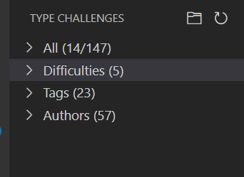
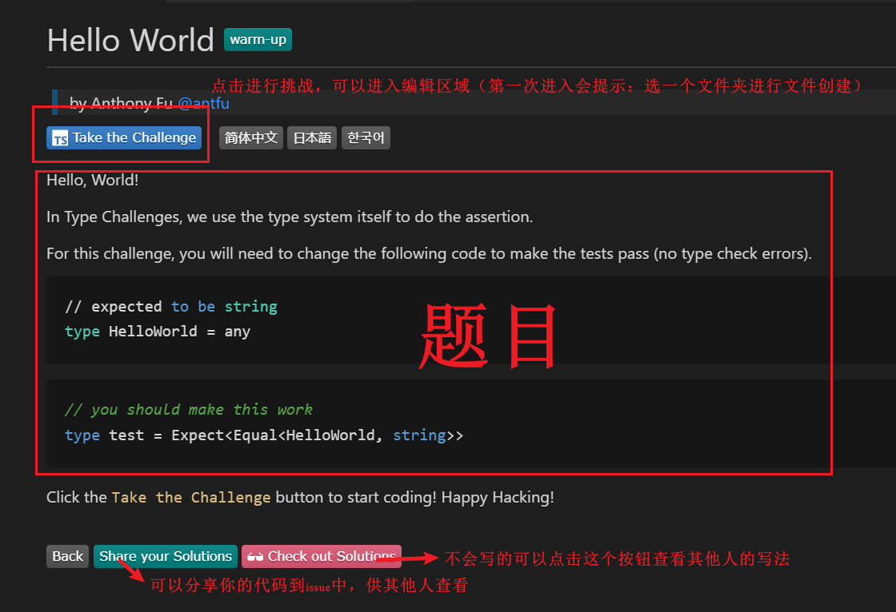

## 前提
因为对ts的用法还仅限于any 及简单的inference中，前几天偶然发现了这样一个神奇的网站[type-challenges](https://github.com/type-challenges)
这个网站可以完整的学习一下ts的一些用法及一些类型：比如PICK,omit,infer 等的一些用法。接下来记录一下

## 如何使用

打开**VSCODE**，点击插件安装`type-challenges`,然后重启**VSCODE**，左侧操作栏中可以看到这样一个内容
，点击可以看到有个目录
。

我是按照困难程度来进行练习的。



## warm
#### 题目
```ts
// ============= Test Cases =============
import type { Equal, Expect, NotAny } from './test-utils'

type cases = [
Expect<NotAny<HelloWorld>>,
Expect<Equal<HelloWorld, string>>,
]
```
### 答案
```ts
// ============= Your Code Here =============
type HelloWorld = string // expected to be a string
```

## 简单篇
### Pick
```ts
// ============= Test Cases =============
import type { Equal, Expect } from './test-utils'

type cases = [
  Expect<Equal<Expected1, MyPick<Todo, 'title'>>>,
  Expect<Equal<Expected2, MyPick<Todo, 'title' | 'completed'>>>,
  // @ts-expect-error
  MyPick<Todo, 'title' | 'completed' | 'invalid'>,
]

interface Todo {
  title: string
  description: string
  completed: boolean
}

interface Expected1 {
  title: string
}

interface Expected2 {
  title: string
  completed: boolean
}
```
### Pick-答案
```ts
// ============= Your Code Here =============
type MyPick<T, K extends keyof T> = {
  [key in K]:T[key]
}
```
#### 知识点
extends: 继承
keyof:
[k in K]: 可以理解为`for...in`,表示从K中去遍历每个类型。比如：
```ts
interface Expected1 {
  title: string
}
type Ka = {[key in Expected1]}
```


